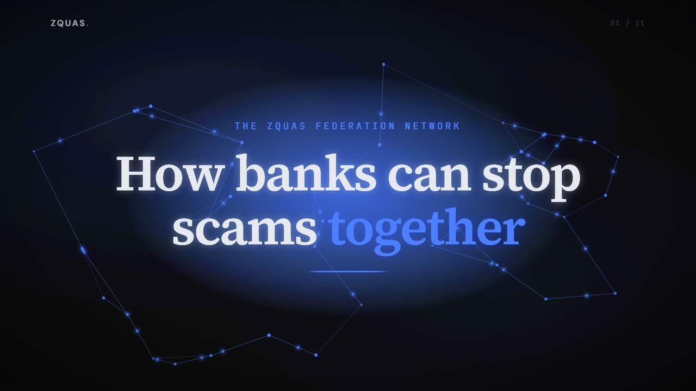

# ZQUAS: Criminals use many banks. Now banks can act as one.

> ZQUAS lets banks catch scam payments and mule accounts together, without pooling customer data. TRL 6, synthetic data only, no production deployments.

Source: https://zquas.ai
Site: https://zquas.ai

---
# How banks can stop scams together

            

[Explore the pilot and evidence ↓](#for-banks)

ZQUAS is taking part in the FCA's Supercharged Sandbox. The FCA does not endorse ZQUAS, its products or its results.

            The pilot

## Join the pilot

TRL 6. Synthetic data only. No production deployments.

            [The 12-week local pilot →](founding-partner.html#pilot-scope)[A synthetic walkthrough →](use-case.html)[Explore the evidence ↓](#results)

### Banks and payment firms

Check the payments coming into your own accounts, on your own data, inside your own installation.

                [Join the pilot](contact.html?audience=banks)

### Crypto exchanges

Review your customers' crypto withdrawals before they leave. In our model, exchanges as members catch about a quarter more scam payments.

                [Join the pilot](contact.html?audience=exchanges)

### Investors and partners

A governance engine with measured results on synthetic data. Financial crime is where it starts.

                [Talk to us](contact.html?audience=investors)

        What we have shown

## Results on synthetic data

            Every result on this page comes from our own tests on synthetic data. None of them is a real-world detection rate.

                About 1 in 2
                Scam payments reviewed with the network
                Synthetic data. In our model.

                    Read the test detail

Our synthetic world has 1,000,000 adults at the UK scam rate. Each bank's own fraud model alone caught about 1 in 7. When we removed our generator's easiest clue, the network figure fell to about 1 in 3. Every limit held, and fewer than 1 genuine payment in 10,000 was reviewed.

                About a quarter more
                With crypto exchanges as members
                Synthetic data at the UK scam rate. In our model.

                    Read the test detail

Two crypto exchanges joined a four-bank network. Each reviews its own customers' crypto withdrawals before they leave. They caught about a quarter more scam payments than the banks alone. Every one of the extra payments was a payment a victim made to buy crypto, and every institution stayed inside its review limits.

                99 in 100
                Decisions in under 10 ms
                Our test. Synthetic data.

                    Read the test detail

Up to 540 simulated bank installations ran together on nine cloud GPUs in one cloud zone.

Limits in the model: at most 1 payment in 1,000 held and 1 in 500 reviewed. Network signals add reviews, never automatic holds. Synthetic data throughout, not real-world detection rates. Position today: TRL 6, no production deployments, no live counterparty data.

            [Download the briefing ↗](zquas-onepager.pdf)
            [Engine benchmarks ↗](benchmark.html)

        The engine underneath

## Built on a governance engine, not a fraud model.

            Every ZQUAS decision runs on the same engine: it applies an institution's rules to decisions made by automated systems and AI agents, at GPU speed, and records why each decision was made so a supervisor can check it. Financial crime is where we start. The same engine can govern decisions in other industries where automated decisions need rules, limits and an audit trail.

        [The platform →](platform.html)

## Explore the details

    How the network works

        How it works

## The receiving bank checks. One report protects every member.

                1

### The receiving bank checks its own accounts

The bank that holds the receiving account checks the payments coming into it. It uses its own view of that account and confirmed scam reports shared across the network. When an account looks like a mule, that bank can review it before more money arrives, even when the victim's bank is not in the network. A paying bank can also ask the holding bank one narrow question about a new payee before the money leaves.

                2

### One confirmed report protects every member

When a victim reports a scam, that confirmed report is shared with every member. The mule account is flagged for review at every bank in the network. The network only ever adds reviews. It never adds automatic holds.

                3

### No customer files leave a bank

No customer files are exchanged, and no raw or directly identifying customer data leaves the institution. Alerts carry proofs that the supervisor can verify. Security today is semi-honest: it assumes each member follows the protocol.

    The scam problem and its sources

        The problem

## Scams cost UK victims £576.4 million in 2025.

            Authorised push payment (APP) scams trick victims into sending the money themselves. The money goes to a mule account, an account the criminals control. One mule account often collects from victims at several different banks, and the money is quickly moved on. Each bank sees only its own customer and its own payment.

                £576.4m
                Lost to APP scams

Lost by victims to APP scams in the UK in 2025, up 19%.

                248,070
                Cases

APP scam cases in the UK in 2025.

                £354.3m
                Reimbursed by banks

Reimbursed by banks in 2025, 61% of losses.

Source: UK Finance, Annual Fraud Report 2026 (figures for 2025).

Under the UK's mandatory reimbursement rules, in force since October 2024, the sending bank and the receiving bank split each reimbursement 50:50, up to £85,000 a claim.

Source: Payment Systems Regulator, APP reimbursement rules.
