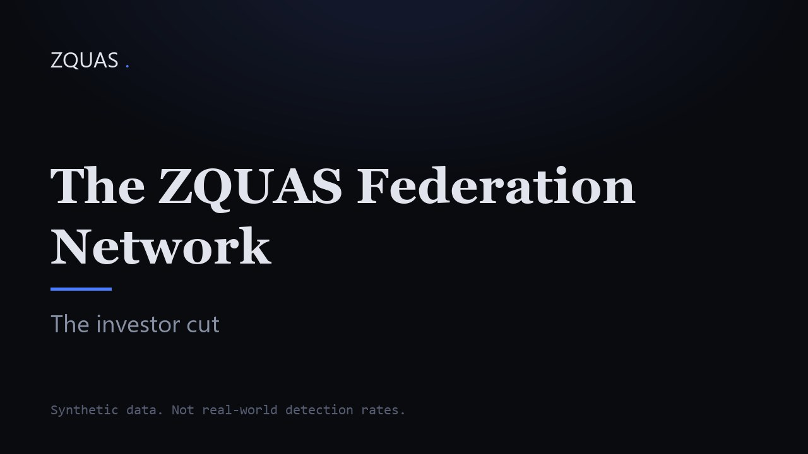

# The ZQUAS platform: a governance engine for automated decisions

> ZQUAS applies an institution's rules to decisions made by automated systems and AI agents, at GPU speed, with proofs a supervisor can verify. Financial crime first.

Source: https://zquas.ai/platform.html
Site: https://zquas.ai

---
The platform

# A governance engine for decisions made by machines.

        ZQUAS applies an institution's rules to decisions made by automated systems and AI agents. It runs on GPUs. Alerts carry proofs that a supervisor can verify. Financial crime is the first use. Other industries come next.

        What the engine is

## Rules, limits and proofs

            The institution writes its rules and sets its limits. The engine applies them to the decisions an automated system or AI agent makes. It evaluates a full policy set against every entity at once on a GPU, with no sampling. Alerts carry proofs that a supervisor can verify without relying on the running production engine or its internal state.

### Rules

Policies are written as code and applied the same way every time. The same policy on the same data gives the same verdict.

### Limits

The institution sets how many payments or decisions may be held or reviewed. The engine stays inside them.

### Proofs

Alerts carry proofs that a supervisor can verify with a public key and a standalone tool. The verifier is written by ZQUAS and currently links the CUDA runtime. A CPU-only verifier is planned.

        Measured on the engine

## Four measured figures

            Each figure is enforced as a bound in our test suite. Each carries its own method.

                500,000 entities under 2 seconds
                Full detection cycle

Enforced as a bound in our test suite. Every one of the 500,000 entities is confirmed evaluated, not sampled. Synthetic population. Method on the [benchmark page](benchmark.html).

                Alert lifecycle under 10 ms
                Local decision latency

The bound is enforced. A single cold alert took 7 to 8 ms. Amortised, an alert takes 0.25 ms.

                Federation round under 10 seconds
                Bilateral round between two institutions

The bound is enforced in CI. We measured 3,052 ms at 100,000 entities per party. The transport is a loopback development transport, not a real inter-participant network. The semi-honest trust model applies.

                GPU memory under 1 GB
                Detection pass working set

The bound is enforced. We measured 562 to 616 MB.

Methodology per figure on the [benchmark page](benchmark.html).

        Why it is general

## The same three needs across industries

            Decisions made by automated systems and AI agents need the same three things across industries: rules, limits and a record of why. The engine keeps those apart from the domain. A domain supplies its entities, its events and its policies. The engine supplies GPU evaluation, limits, federation between institutions and proofs.

        Where we start

## Financial crime first. Other industries next.

            Financial crime is where ZQUAS starts. Our measured results are on scam payments and mule accounts, on synthetic data. Money laundering detection follows. Other industries come after, where automated decisions need rules, limits and an audit trail.

        Position today

## TRL 6, on synthetic data

            TRL 6 means an integrated prototype demonstrated in a controlled relevant environment. All validation is on synthetic data. There are no production deployments and no live counterparty data. Security is semi-honest only. Protection against a participant that deliberately deviates from the protocol needs malicious-adversary security, which is not implemented for bilateral or multi-party federation.

        For investors

## The investor cut

            A shorter version of the film for investors and partners.

                 

                    ▶
                    Play the investor cut

            Playing loads the video from YouTube.

Results in the film are on synthetic data, not real-world detection rates. English captions are available.

        Next step

## Talk to us

            [Talk to us](contact.html)
            [Technical overview](technology.html)
            [Benchmark](benchmark.html)
